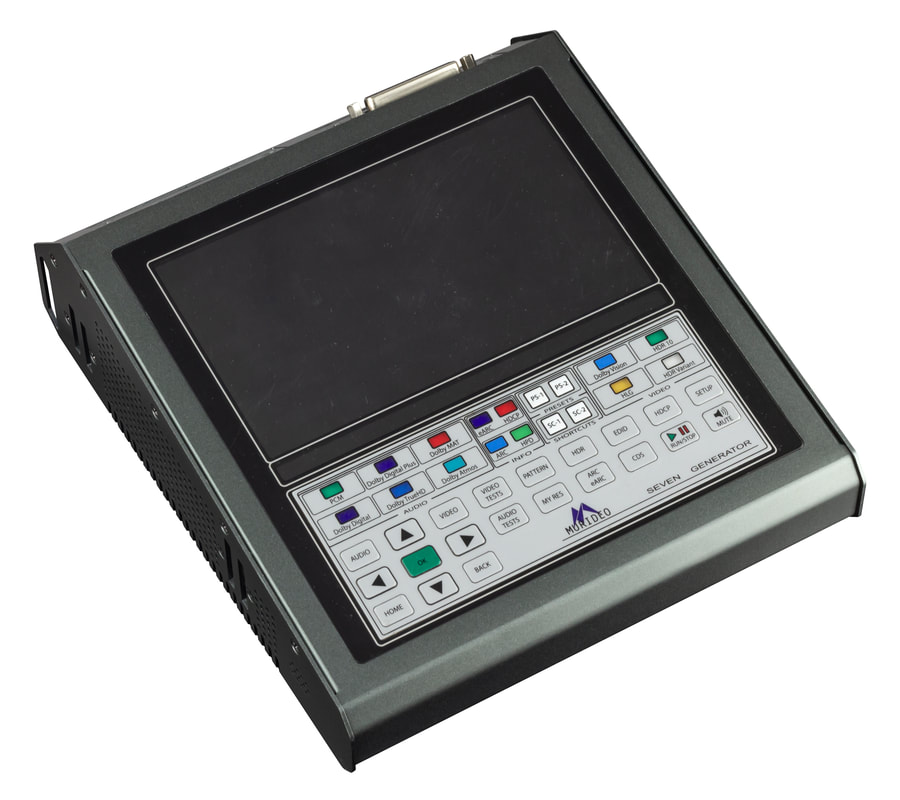

# Murideo 8K Seven Generator Websocket API

## Table of Contents

- [Murideo 8K Seven Generator Websocket API](#murideo-8k-seven-generator-websocket-api)
  - [Table of Contents](#table-of-contents)
  - [Goals](#goals)
    - [Short Term](#short-term)
    - [Long Term](#long-term)
  - [Current Status](#current-status)
    - [About Me](#about-me)
    - [About Murideo](#about-murideo)

## Goals

### Short Term

1. Create a Python wrapper to control the Murideo 8K Seven Generator
2. Ability to create templates for automatic testing

### Long Term

1. Decode responses to be able to gather information from the testing to create reports
2. Build API for Murideo 8K Seven Analyzer to read results to add to report
3. Create a WebUI for automatic testing and report handling

## Current Status

Currently I just figured out the commands for the WebUI. Right now I'm writing the dictionary that will hold all of the commands to be used. I've lightly tested a websocket for proof of concept.

### About Me

Hi I'm Justin. I work for a manufacture that makes HDMI Products. We use Murideo to do a lot of our testing of our products. I've received documentation from Murideo which is terrible and is only for RS232 Control.

Programming is not my job, but I write programs to help with my workflow and this will be helpful but is a bit larger than I am used too.

### About Murideo

MU-GEN-SEVEN
The Seven Generator: An Approved Test Device for Dolby Vision™ and Dolby Audio™​

Impeccable performance in HDMI video generation is just the beginning with the the SEVEN Generator. The extensive audio and video capabilities include:

- An Approved Test Device for Dolby Audio™
- ARC, eARC Generator
- Up to 120 Frame Video Playback and Testing
- A/V Sync, Audio Latency, Video Latency (AV Sync & Input Lag)
- Dolby Vision, HDR, HLG, SDR Support
- User Patterns & Video Uploads (USB 3.0)
- Raw YUV Video & Test Pattern Playback
- Diversified Video Solutions (DVS) HDR Test pattern Suite (YUV)
- Other clips and patterns from ISF, PVA, Spears & Munsil, Sony Pictures, Portrait Displays, and Bill Wetzel
